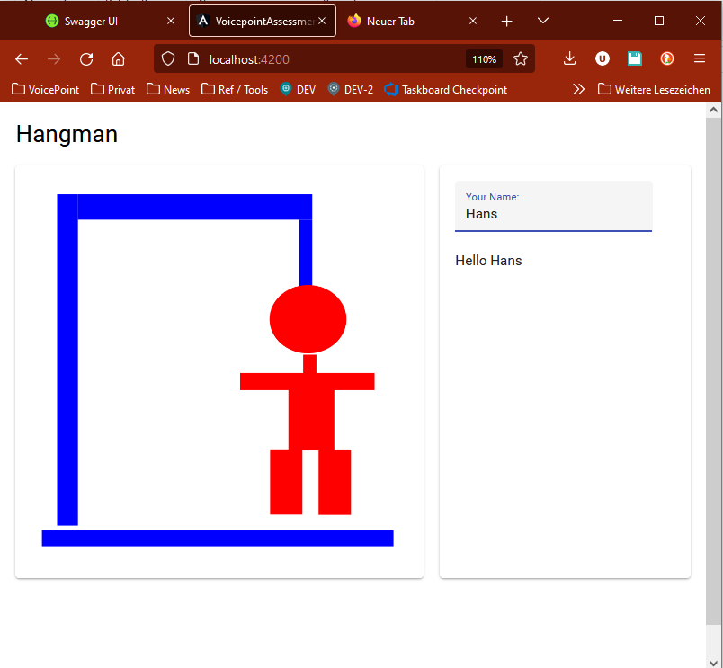

<div style="text-align: right">
02.03.23/ume
</div>

<!-- TOC -->
* [Voicepoint Developer Assessment](#voicepoint-developer-assessment)
  * [Spezifikation](#spezifikation)
    * [Weitere Anforderungen](#weitere-anforderungen)
    * [Nicht-funktionale Anforderungen](#nicht-funktionale-anforderungen)
  * [Vorlage für das Assessment](#vorlage-für-das-assessment)
    * [Backend](#backend)
    * [Frontend](#frontend)
<!-- TOC -->

# Voicepoint Developer Assessment

- Im Rahmen des Assessments entwickeln Sie ein [Hangman-Spiel](https://de.wikipedia.org/wiki/Galgenm%C3%A4nnchen).
- Zeit für das Lösen dieser Aufgabe: **2 Stunden**
- Bei Fragen steht ein Mitarbeiter der Voicepoint zur Verfügung
- Ihnen steht ein PC zur Verfügung, der wie folgt vorbereitet ist:
  - Installierte Applikationen:
    - Visual Studio 2022
    - Visual Studio Code
    - Chrome
  - Im Verzeichnis `C:\git\Assessment` ist eine Vorlage vorhanden, auf der Sie Ihre Lösung aufbauen können
- Die Assessment-Vorlage ist so eingerichtet, dass das Frontend mit Angular (Material Design) entwickelt wird.
  Alternativ kann auch ein anderes Javascript-Framework verwendet werden, wobei dieses selber eingerichtet werden muss.
- Sollte es Ihnen nicht möglich sein, die Aufgabe mit Webtechnologien zu lösen, konzentrieren Sie sich bitte auf das Backend und verwenden Sie Swagger, um die Methoden auszuführen. Falls Zeit bleibt, können Sie auch ein einfaches Winforms / WPF-Projekt zur Darstellung verwenden.
- Bitte lesen Sie dieses Dokument ganz durch, bevor Sie mit der Aufgabestellung beginnen. 
- Das Internet darf benutzt werden. Bitte googeln Sie aber nicht nach "how to implement Hangman in C#" oder ähnlichem 😀
- Die Zeit für die Aufgabe ist knapp bemessen. Priorisieren Sie Ihre Arbeit bitte wie folgt:
  - höchste Priorität hat wartbarer Code (Clean-Code Prinzipien beachten).
    - Es wird nicht erwartet, dass Sie ein ausgefeiltes Routing oder eine komplexe Komponentenstruktur in Angular umsetzen. 
  - Das Spiel sollte zunächst grundsätzlich funktionieren, bevor die weiteren Anforderungen implementiert werden (siehe [Weitere Anforderungen](#weitere-anforderungen)).
  - Verwenden Sie nicht viel Zeit auf das schöne Aussehen des User Interfaces. Wichtiger ist der Code dahinter.
  - Implementieren Sie _keine_ Features, die nicht spezifiziert worden sind (bsp. Validierungen, Error Handling, Multi-User-Fähigkeit, Login, Datenbank-Zugriffe).

## Spezifikation

1. Hangman ist ein Spiel für 2 Spieler.
2. **Phase 1:** Nach dem Start des Spiels kann zunächst der erste Spieler eines oder mehrere Wörter eingeben.
    
   Das Wort wird nun "verdeckt" dargestellt. Sämtliche Buchstaben werden durch Striche (`-`) ersetzt. Falls es sich um
   mehrere Wörter handelt, sind die Leerzeichen dazwischen sichtbar. Für jedes Leerzeichen wird ein Unterstrich (`_`)
   angezeigt.

   Beispiel:

   ```
   Gesuchte Wörter: "DIE SONNE SCHEINT"
   Anzeige:         "- - - _ - - - - - _ - - - - - - -"
   ```
3. **Phase 2:** Der zweite Spieler muss das Wort erraten. Er kann dazu einen beliebigen Buchstaben tippen.

   a) kommt der Buchstabe in den gesuchten Wörtern vor, so werden die entsprechenden Striche durch die aufgedeckten
   Buchstaben ersetzt.

   Beispiel:

   ```
   Gesuchte Wörter:        "DIE SONNE SCHEINT"
   Eingegebener Buchstabe: "E"
   Anzeige:                "- - E _ - - - - E _ - - - E - - -"
   ```

   b) Kommt der Buchstabe in den gesuchtern Wörtern *nicht* vor, so wird stattdessen der Galgen um ein Element
   erweitert.

   Der Galgen soll zu Beginn der **Phase 2** nicht sichtbar sein.

4. Phase 2 wird solange wiederholt, bis das Spiel endet. 

   Das Spiel endet, wenn alle Buchstaben erraten wurden (Spieler 2 gewinnt), oder wenn der Galgen vollständig angezeigt
   wurde (Spieler 1 gewinnt).

5. **Phase 3**: Es wird angezeigt, welcher Spieler gewonnen hat.

### Weitere Anforderungen

❗ Implementieren Sie diese Anforderungen erst, wenn das Spiel, wie oben beschrieben, prinzipiell funktioniert.  

- Während **Phase 2** sollen drei Schaltflächen zur Verfügung stehen:
  
  a) `Spielstand speichern`: Der aktuelle Spielstand wird gespeichert. 
     
     *Implementationshinweis:* Der Spielstand soll im Backend in einem File gespeichert werden.
  
  b) `Spielstand laden`: Der aktuelle Spielstand wird geladen. Das Spiel kann vom aktuellen Spielstand aus fortgesetzt werden.

  c) `Spiel abbrechen`. Es wird wieder **Phase 1** dargestellt, d.h. Spieler 1 kann ein Wort erfassen.
- Während **Phase 3** soll die Schaltfläche `Neues Spiel` angezeigt werden.

### Nicht-funktionale Anforderungen

- Das User Interface soll mit Webtechnologien/Typescript (wenn möglich Angular) entwickelt werden.
- Alle Logik soll in einem Backend, das auf .NET 7 / ASP<b>.</b>NET Web Api / C#
  11 basiert, entwickelt werden.
- Die Logik auf dem Backend soll so entwickelt werden, dass sie durch Unit tests testbar ist
  - Für *eine* Methode der Logik soll ein Unittest erstellt werden.
- Die Applikation muss _nicht_ multi-user fähig sein. 
  - das Backend muss _nicht_ zwischen mehreren Benutzern unterscheiden
  - es muss _kein_ Login, Benutzerkonto o.ä. implementiert werden

## Vorlage für das Assessment

Für die Entwicklung dieses Projektes steht Ihnen eine Vorlage zur Verfügung, damit Sie nicht bei Null anfangen müssen.

Diese Vorlage implementiert ein "Hello World". Im Frontend kann ein Name eingegeben werden, und man wird entsprechend gegrüsst.



Die Vorlage besteht aus den Projekten **Backend** und **Frontend**, die im Folgenden beschrieben werden.

### Backend


- Die Solution `\dotnet\voicepoint-assessment.sln` kann mit Visual Studio 2022 geöffnet werden.
- Sie enthält die folgenden Projekte:
    - `voicepoint-assessment`: Executable. 
  
      Folder:
        - `Api`: Web Api-Controller und -Models zur Kommunikation mit dem Frontend
        - `Services`: Klassen, welche die Logik beinhalten. Jede Service-Klasse besitzt ein Interface, um Dependency
          Injection zu ermöglichen
    - `voicepoint-assessment.Tests`: XUnit Test-Projekt. 
  
      *Ihre Unit-Tests erfassen Sie bitte in diesem Projekt.*
    - `Voicepoint.CliTools.WebApiClientGenerator`: Tool, welches automatisch den Proxy-Code für das Frontend erzeugt,
      welches vom Frontend aus den Zugriff auf das API des Backends ermöglicht. 
  
      *In diesem Projekt muss durch Sie nichts angepasst werden*.

**Start in Visual Studio:**

1. `voicepoint-assessment` als Start-Projekt festlegen

2. Projekt mit `F5` starten

3. Es öffnet sich ein Terminal-Fenster, welches das laufende Web API-Backend hostet
   
   

4. Der Browser wird mit [Swagger](http://localhost:5012/swagger/index.html) geöffnet, mit welcher das bestehende API ausprobiert werden kann
   
   


### Frontend


- Der Folder `\web\voicepoint-assessment` kann mit Visual Studio Code geöffnet werden
- Sie enthält die folgenden Folder:
    - `src\app\`
        - `api\web-api.module.ts`. Dies ist das mit Swagger generierte Proxy auf das Backend. 
      
          *Diese Datei wird jeweils automatisch neu generiert, wenn das Backend-Projekt gebuildet wird.*
    - 
        - `app.component.html / .ts / .scss`: Angular-Komponente, welche Sie für die Lösung dieser Aufgabe anpassen müssen. Die Komponente ist bereits so vorbereitet, dass auf der linken Seite ein Hangman-Bild dargestellt wird, und auf
          der rechten Seite ein Eingabebereich vorhanden ist.
      
        - `assets`: Enthält 7 vorbereitete Hangman-Bilder im `svg`-Format, welche für die Darstellung der Spielphasen verwendet werden können.
          

**Start in VS Code:**

- in Terminal-Fenster:
  ```
  cd C:\git\Assessment\web\voicepoint-assessment
  ng serve --open
  ```
- öffnet ein Browser-Window auf `http://localhost:4200`
- Sofern das Backend ebenfalls gestartet ist, sollte der Zugriff auf das Backend-API möglich sein. 
- Die API Zugriffe können im Browser mit der Developer-Konsole (`F12`) verfolgt werden:
  
  
